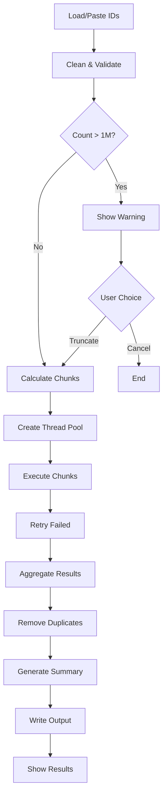

# CockroachDB Firm Query Tool - Implementation Specification

## Project Overview

Build a Python desktop application using Tkinter that connects to CockroachDB via JDBC/Kerberos authentication to execute SQL queries with large lists of firm_root_id values. The application must handle up to 1 million IDs, chunk them appropriately for IN clause limitations, and export results to CSV/Excel format.

## Technical Requirements

### Core Technologies
- **Language**: Python 3.12+
- **UI Framework**: Tkinter (built-in)
- **Database**: CockroachDB via JDBC
- **Authentication**: Kerberos
- **Package Manager**: Poetry
- **Dependencies**:
  - jaydebeapi>=1.2.3
  - jpype1>=1.5.0
  - pandas>=2.0.0
  - openpyxl>=3.1.0
  - pyyaml>=6.0
  - pydantic>=2.0.0

### Constraints
- Maximum 2 concurrent database connections
- Query timeout: 5 minutes
- Maximum query string length: 15,000 characters
- Maximum IDs per execution: 1,000,000 (with warning)
- Expected ID length: 37 characters (plan for 50)
- Output: 18 columns, 1 row per firm_root_id
- Chunk size: ~250 IDs per query

## Project Structure

```
cockroach-firm-query/
├── pyproject.toml
├── poetry.lock
├── config.yaml
├── README.md
├── src/
│   └── firm_query_tool/
│       ├── __init__.py
│       ├── main.py                 # Application entry point
│       ├── core/
│       │   ├── __init__.py
│       │   ├── connection.py       # Database connection management
│       │   ├── kerberos_auth.py    # Kerberos authentication
│       │   └── jvm_manager.py      # JVM lifecycle management
│       ├── services/
│       │   ├── __init__.py
│       │   ├── chunking_service.py # ID list chunking logic
│       │   ├── query_executor.py   # Query execution with retry
│       │   ├── result_aggregator.py # Result combination
│       │   └── id_processor.py     # ID cleaning and validation
│       ├── ui/
│       │   ├── __init__.py
│       │   ├── main_window.py      # Main application window
│       │   ├── config_window.py    # Configuration editor
│       │   └── components/
│       │       ├── __init__.py
│       │       ├── input_panel.py  # ID input handling
│       │       ├── progress_panel.py # Progress display
│       │       └── result_panel.py  # Results and summary
│       ├── config/
│       │   ├── __init__.py
│       │   ├── manager.py          # Configuration management
│       │   └── models.py           # Pydantic config models
│       ├── output/
│       │   ├── __init__.py
│       │   ├── csv_writer.py       # CSV export
│       │   └── excel_writer.py     # Excel export
│       └── utils/
│           ├── __init__.py
│           ├── exceptions.py       # Custom exceptions
│           └── constants.py        # Application constants
├── tests/
│   ├── __init__.py
│   ├── test_chunking.py
│   ├── test_id_processor.py
│   ├── test_query_executor.py
│   └── test_integration.py
└── resources/
    └── sql_template.sql            # SQL query template
```

## Implementation Details

### 1. Database Connection Module

```python
# src/firm_query_tool/core/connection.py

"""
Database connection management with JDBC and Kerberos.

Requirements:
- Singleton JVM instance
- Maximum 2 concurrent connections
- Connection timeout: 30 seconds
- Query timeout: 5 minutes
- Automatic retry on connection failure
"""

class DatabaseConnection:
    """
    Manages CockroachDB connection via JDBC with Kerberos auth.
    
    Configuration loaded from config.yaml:
    - host, port, database
    - Kerberos settings (krb5_conf, jaas_conf, spn)
    - Timeout settings
    
    Methods:
    - connect(): Establish connection
    - execute_query(sql, params=None): Execute single query
    - close(): Close connection
    - test_connection(): Verify connectivity
    """
    pass

class ConnectionPool:
    """
    Manages pool of maximum 2 connections.
    
    Methods:
    - get_connection(): Get available connection
    - release_connection(conn): Return connection to pool
    - close_all(): Close all connections
    """
    pass
```

### 2. ID Processing Service

```python
# src/firm_query_tool/services/id_processor.py

"""
Process and validate firm_root_id values.

Requirements:
- Trim whitespace
- Remove single and double quotes
- Remove duplicates
- Validate format (alphanumeric, max 50 chars)
- Track statistics (total, cleaned, duplicates)
"""

class IDProcessor:
    """
    Clean and validate firm_root_id list.
    
    Methods:
    - process_ids(id_list): Clean and validate IDs
    - load_from_csv(filepath): Load IDs from CSV file
    - parse_from_text(text): Parse IDs from pasted text
    
    Returns:
    - cleaned_ids: List of valid IDs
    - stats: Dictionary with processing statistics
    """
    
    MAX_ID_LENGTH = 50
    EXPECTED_ID_LENGTH = 37
    
    def clean_id(self, id_value: str) -> str:
        """
        Clean single ID:
        1. Strip whitespace
        2. Remove quotes (single and double)
        3. Validate length
        4. Return cleaned ID or None if invalid
        """
        pass
```

### 3. Chunking Service

```python
# src/firm_query_tool/services/chunking_service.py

"""
Split ID list into chunks for IN clause.

Requirements:
- Maximum query length: 15,000 characters
- Account for SQL template overhead
- Target chunk size: 250 IDs
- Calculate based on actual ID lengths
"""

class ChunkingService:
    """
    Calculate and create chunks of IDs.
    
    Constants:
    - MAX_QUERY_LENGTH = 15000
    - SAFETY_MARGIN = 0.8  # Use 80% of max
    - DEFAULT_CHUNK_SIZE = 250
    
    Methods:
    - calculate_chunk_size(id_list): Determine optimal chunk size
    - create_chunks(id_list, chunk_size): Split into chunks
    - estimate_total_chunks(id_count): Estimate chunks needed
    """
    pass
```

### 4. Query Executor

```python
# src/firm_query_tool/services/query_executor.py

"""
Execute chunked queries with retry logic.

Requirements:
- Maximum 2 concurrent threads
- Retry failed chunks up to 2 times
- 5-second delay between retries
- Track progress per chunk
- Aggregate results
"""

class QueryExecutor:
    """
    Execute queries in parallel with retry.
    
    SQL Template (embedded):
    SELECT DISTINCT
        t1.firm_root_id,
        t1.column1, t1.column2, ..., t1.column16,
        t2.column17, t2.column18
    FROM table1 t1
    JOIN table2 t2 ON t1.join_key = t2.join_key
    WHERE t1.firm_root_id IN ({ID_PLACEHOLDER})
    
    Methods:
    - execute_chunks(chunks, progress_callback): Execute all chunks
    - execute_single_chunk(chunk_ids): Execute one chunk
    - retry_failed_chunk(chunk_ids, attempt): Retry with backoff
    """
    
    MAX_RETRIES = 2
    RETRY_DELAY = 5  # seconds
    MAX_THREADS = 2
    
    pass

class ExecutionState:
    """
    Track execution state for cancel/resume.
    
    Attributes:
    - status: IDLE, RUNNING, PAUSED, CANCELLED, COMPLETED
    - total_chunks: Total number of chunks
    - completed_chunks: List of completed chunk indices
    - failed_chunks: List of failed chunk indices
    - pending_chunks: List of pending chunk indices
    - partial_results: Accumulated results so far
    """
    pass
```

### 5. Main UI Window

```python
# src/firm_query_tool/ui/main_window.py

"""
Main application window using Tkinter.

Layout:
+------------------------------------------+
| File  Edit  Config  Help                 |
+------------------------------------------+
| INPUT SECTION                            |
| [Load CSV] [Paste] [Clear]              |
| +--------------------------------------+ |
| | ID Preview (first 100 shown)        | |
| | ID001                                | |
| | ID002                                | |
| | ...                                  | |
| +--------------------------------------+ |
| Status: 20,000 IDs loaded (15 dupes)    |
+------------------------------------------+
| EXECUTION SECTION                        |
| Output File: [___________] [Browse]      |
| Format: (•) CSV ( ) Excel Both           |
| [Execute] [Cancel] [Resume] [Config]     |
+------------------------------------------+
| PROGRESS SECTION                         |
| Overall: [████████░░] 80% (40/50 chunks)|
| Current: Processing chunk 41...          |
| Time Elapsed: 15:23 | ETA: 3:47         |
| Records Found: 16,000 / 20,000          |
+------------------------------------------+
| RESULTS SECTION                          |
| ✓ Execution Complete                     |
| • Input IDs: 20,000                     |
| • Found: 19,850                         |
| • Missing: 150 [View List]              |
| • Duplicates Removed: 25                |
| • Output: /path/to/output.csv           |
+------------------------------------------+
"""

class MainWindow:
    """
    Main application window.
    
    Components:
    - MenuBar: File, Edit, Config, Help menus
    - InputPanel: Load/paste IDs, preview, stats
    - ExecutionPanel: Output settings, action buttons
    - ProgressPanel: Real-time progress display
    - ResultPanel: Summary and missing IDs
    
    Methods:
    - load_csv(): Open file dialog and load IDs
    - paste_ids(): Get IDs from clipboard
    - execute_query(): Start query execution
    - cancel_execution(): Cancel running query
    - resume_execution(): Resume paused query
    - open_config(): Open configuration window
    - update_progress(chunk, total): Update progress display
    - show_results(stats): Display final results
    """
    pass
```

### 6. Configuration Window

```python
# src/firm_query_tool/ui/config_window.py

"""
Configuration editor window.

Tabs:
1. Database Settings
   - Host, Port, Database Name
   - Connection Timeout
   - Query Timeout
   
2. Kerberos Settings
   - KRB5 Config Path
   - JAAS Config Path
   - Service Principal Name
   - Ticket Cache Path
   
3. Processing Settings
   - Default Chunk Size
   - Max Query Length
   - Retry Attempts
   - Thread Count (1 or 2)
   
4. Output Settings
   - Default Output Directory
   - File Naming Pattern
   - CSV/Excel Options

Buttons:
- [Test Connection]: Verify database connectivity
- [Save]: Save configuration to file
- [Cancel]: Close without saving
- [Restore Defaults]: Reset to default values
"""

class ConfigWindow:
    """
    Configuration editor dialog.
    
    Methods:
    - load_config(): Load current configuration
    - save_config(): Validate and save configuration
    - test_connection(): Test database connection
    - restore_defaults(): Reset to default values
    """
    pass
```

### 7. Configuration Schema

```yaml
# config.yaml

application:
  name: "Firm Root ID Query Tool"
  version: "1.0.0"

database:
  host: "localhost"
  port: 26257
  database: "defaultdb"
  connection_timeout: 30  # seconds
  query_timeout: 300      # 5 minutes
  max_connections: 2

kerberos:
  krb5_conf: "/path/to/krb5.conf"
  jaas_conf: "/path/to/jaas.conf"
  spn: "cockroachdb"
  ticket_cache: "/path/to/krb5cc_username"

processing:
  chunk_size: 250
  max_query_length: 15000
  max_retries: 2
  retry_delay: 5
  thread_count: 2
  max_input_ids: 1000000
  warning_threshold: 900000

validation:
  max_id_length: 50
  expected_id_length: 37
  trim_whitespace: true
  remove_quotes: true
  remove_duplicates: true
  case_sensitive: false

output:
  default_directory: "./output"
  filename_pattern: "firm_query_{timestamp}"
  timestamp_format: "%Y%m%d_%H%M%S"
  
  csv:
    enabled: true
    delimiter: ","
    include_header: true
    quoting: "minimal"
    
  excel:
    enabled: true
    include_summary: true
    freeze_header: true
    auto_column_width: true

logging:
  level: "INFO"
  file: "./logs/firm_query.log"
  format: "%(asctime)s - %(name)s - %(levelname)s - %(message)s"
```

### 8. Result Aggregation

```python
# src/firm_query_tool/services/result_aggregator.py

"""
Aggregate results from multiple chunks.

Requirements:
- Combine results from all chunks
- Remove duplicate rows
- Track missing IDs
- Generate summary statistics
- Handle partial results on failure
"""

class ResultAggregator:
    """
    Combine and process query results.
    
    Methods:
    - add_chunk_result(chunk_ids, result_rows): Add chunk results
    - get_missing_ids(): Return IDs with no results
    - get_duplicate_count(): Count of removed duplicates
    - get_final_results(): Get deduplicated results
    - generate_summary(): Create execution summary
    
    Tracking:
    - input_ids: Set of all input IDs
    - found_ids: Set of IDs with results
    - result_rows: List of result dictionaries
    - duplicates: Count of duplicate rows removed
    """
    pass
```

### 9. Output Writers

```python
# src/firm_query_tool/output/csv_writer.py

"""
Export results to CSV format.

Requirements:
- Single output file for all results
- Include header row with column names
- Handle up to 1 million rows
- Use pandas for efficient writing
"""

class CSVWriter:
    """
    Write results to CSV file.
    
    Methods:
    - write(filepath, data, columns): Write data to CSV
    - append(filepath, data): Append to existing CSV
    """
    pass

# src/firm_query_tool/output/excel_writer.py

"""
Export results to Excel format.

Requirements:
- Single .xlsx file output
- Include summary sheet with statistics
- Format headers
- Auto-adjust column widths
- Handle up to 1M rows per sheet
"""

class ExcelWriter:
    """
    Write results to Excel file.
    
    Methods:
    - write(filepath, data, columns, summary): Create Excel file
    - add_summary_sheet(workbook, stats): Add summary statistics
    - format_headers(worksheet): Apply header formatting
    """
    pass
```

### 10. Exception Hierarchy

```python
# src/firm_query_tool/utils/exceptions.py

"""
Custom exception classes.
"""

class FirmQueryException(Exception):
    """Base exception for application."""
    pass

class ConnectionException(FirmQueryException):
    """Database connection errors."""
    pass

class KerberosException(FirmQueryException):
    """Kerberos authentication errors."""
    pass

class ValidationException(FirmQueryException):
    """Input validation errors."""
    pass

class QueryException(FirmQueryException):
    """Query execution errors."""
    pass

class ConfigurationException(FirmQueryException):
    """Configuration errors."""
    pass

class ChunkingException(FirmQueryException):
    """Chunking calculation errors."""
    pass
```

## Implementation Flow

### Execution Sequence



### Threading Model

```
Main Thread:
- UI updates
- User interactions
- Progress monitoring

Worker Thread 1:
- Process odd-indexed chunks
- Retry logic
- Result collection

Worker Thread 2:
- Process even-indexed chunks
- Retry logic
- Result collection

Synchronization:
- Queue for chunk distribution
- Lock for result aggregation
- Event for cancellation
```

## Testing Requirements

### Unit Tests

```python
# tests/test_id_processor.py
"""
Test ID cleaning and validation:
- Whitespace trimming
- Quote removal
- Duplicate detection
- Invalid ID handling
- CSV parsing
- Text parsing
"""

# tests/test_chunking.py
"""
Test chunk calculation:
- Optimal chunk size
- Edge cases (very long IDs)
- Empty input handling
- Single ID handling
"""

# tests/test_query_executor.py
"""
Test query execution:
- Successful execution
- Retry on failure
- Timeout handling
- Cancellation
- Result aggregation
"""
```

### Integration Tests

```python
# tests/test_integration.py
"""
End-to-end testing:
- Load CSV with 1000 IDs
- Execute chunked queries
- Verify results
- Export to CSV/Excel
- Verify missing ID detection
"""
```

## Error Handling Patterns

### Connection Errors
```python
try:
    connection = get_connection()
except KerberosException:
    show_error("Kerberos authentication failed. Please run kinit.")
except ConnectionException as e:
    show_error(f"Database connection failed: {e}")
    offer_retry()
```

### Query Execution Errors
```python
for attempt in range(MAX_RETRIES):
    try:
        result = execute_query(chunk)
        break
    except TimeoutError:
        if attempt < MAX_RETRIES - 1:
            sleep(RETRY_DELAY * (attempt + 1))
        else:
            log_failed_chunk(chunk)
            continue_with_next_chunk()
```

### Input Validation
```python
if not ids:
    show_error("No IDs provided. Please load or paste IDs.")
    return

if len(ids) > MAX_IDS:
    response = show_warning(
        f"Input contains {len(ids)} IDs, exceeding the "
        f"{MAX_IDS} limit. Options:\n"
        "1. Truncate to first 1M\n"
        "2. Cancel operation"
    )
```

## Performance Considerations

### Memory Management
- Stream results to file instead of holding in memory
- Process chunks incrementally
- Clear processed data after writing
- Use generators for large ID lists

### Query Optimization
- Use prepared statements for repeated queries
- DISTINCT in SQL to reduce network transfer
- Index on firm_root_id column (database side)

### UI Responsiveness
- Update progress every second, not every row
- Use threading to prevent UI freezing
- Batch UI updates for efficiency

## Deployment Instructions

### Development Setup
```bash
# Install Poetry
pip install poetry

# Clone repository
git clone <repository>
cd cockroach-firm-query

# Install dependencies
poetry install

# Run application
poetry run python src/firm_query_tool/main.py
```

### Configuration
1. Copy `config.yaml.example` to `config.yaml`
2. Update database connection settings
3. Set Kerberos configuration paths
4. Adjust processing parameters as needed

### Building Executable
```bash
# Install PyInstaller
poetry add --dev pyinstaller

# Build executable
poetry run pyinstaller \
    --onefile \
    --windowed \
    --name "FirmQueryTool" \
    --add-data "config.yaml:." \
    src/firm_query_tool/main.py
```

## Logging Strategy

### Log Levels
- **DEBUG**: Detailed chunk processing, individual IDs
- **INFO**: Execution start/stop, chunk completion, summary
- **WARNING**: Retry attempts, missing IDs, truncation
- **ERROR**: Connection failures, query errors, exceptions

### Log Format
```
2024-01-15 10:30:45 - QueryExecutor - INFO - Starting execution with 20000 IDs in 80 chunks
2024-01-15 10:30:46 - QueryExecutor - INFO - Chunk 1/80 completed (250 IDs)
2024-01-15 10:31:15 - QueryExecutor - WARNING - Chunk 15/80 failed, retrying (attempt 1/2)
2024-01-15 10:45:00 - QueryExecutor - INFO - Execution complete: 19850 found, 150 missing
```

## Success Criteria

1. ✅ Process 20,000 IDs in under 20 minutes
2. ✅ Handle up to 1M IDs with warning
3. ✅ Automatic retry on transient failures
4. ✅ Clean input data (trim, remove quotes, deduplicate)
5. ✅ Track and report missing IDs
6. ✅ Export to CSV and Excel formats
7. ✅ Cancel and resume functionality
8. ✅ Configuration UI for all settings
9. ✅ Maximum 2 concurrent database connections
10. ✅ Clear progress feedback during execution

## Future Enhancements

1. Query history and favorites
2. Schedule execution for off-hours
3. Email notification on completion
4. Multiple SQL template support
5. Results caching for repeated queries
6. Command-line interface option
7. REST API for integration
8. Docker containerization

---

**Note for AI Implementation**: This specification provides complete requirements for building the Firm Query Tool. Follow the architecture, use the provided file structure, implement all error handling patterns, and ensure thread safety for concurrent execution. The application should be production-ready with proper logging, configuration management, and user feedback.